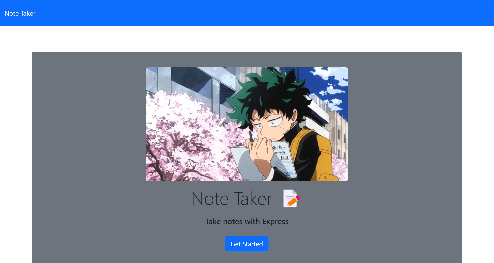
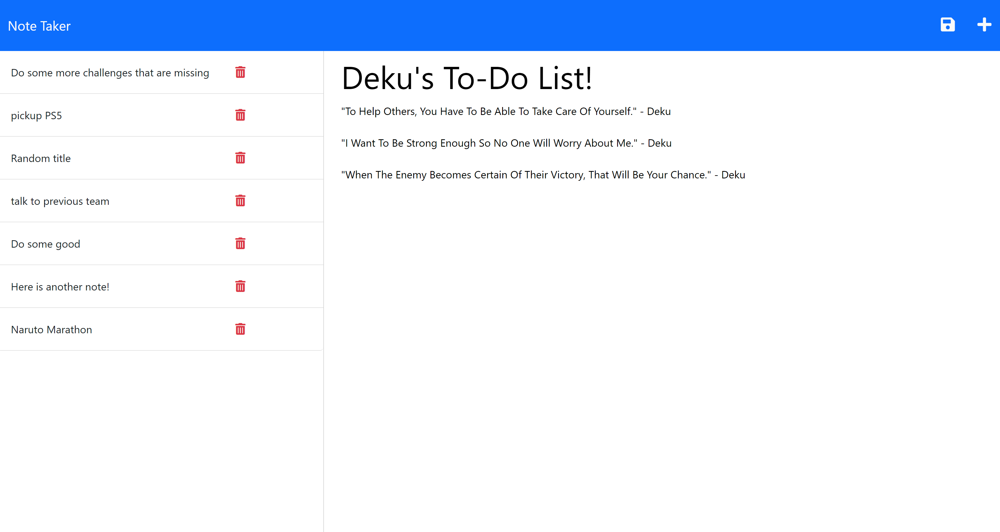

link: https://deku-note-taker-1540c52d78bc.herokuapp.com/

## Description

In this application you can create and manage notes that you need to jot down!
Whether it be something as simple as a phone number or maybe something as complex as a to-do list!

## Usage

Begin by selecting the button to take you to the notes page! Here you can edit the title and contents
of the nest that you are currently writing. Once finished you can click the save icon and see your note
populate within the list!

### Note taker home page!!!

### Note creation page!!!

These are the main screenshots of how the app should be presented and used!

## Technologies used!

I ended up using quite a few different things!

- Prettier, Node, Express, HTML, CSS, and JavaScript as well!

## Credit

Ismael Jimenez: https://github.com/Idjjurado

## License

MIT License (see repo)

## Acceptance Criteria:

### User Story!

AS A small business owner
I WANT to be able to write and save notes
SO THAT I can organize my thoughts and keep track of tasks I need to complete

GIVEN a note-taking application

- WHEN I open the Note Taker
  - THEN I am presented with a landing page with a link to a notes page
- WHEN I click on the link to the notes page
  - THEN I am presented with a page with existing notes listed in the left-hand column, plus empty fields to enter a new note title and the note’s text in the right-hand column
- WHEN I enter a new note title and the note’s text
  - THEN a Save icon appears in the navigation at the top of the page
- WHEN I click on the Save icon
  - THEN the new note I have entered is saved and appears in the left-hand column with the other existing notes
- WHEN I click on an existing note in the list in the left-hand column
  - THEN that note appears in the right-hand column
- WHEN I click on the Write icon in the navigation at the top of the page
  - THEN I am presented with empty fields to enter a new note title and the note’s text in the right-hand column
